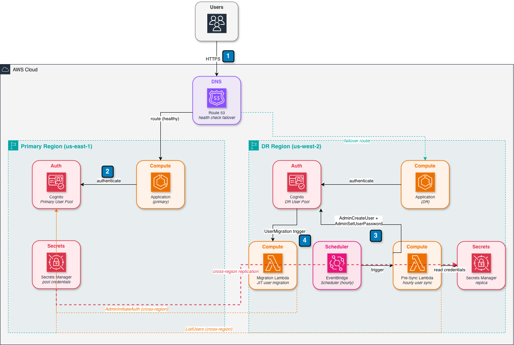

# Amazon Cognito Cross-Region Disaster Recovery

An AWS-native disaster recovery solution for Amazon Cognito User Pools using **Pre-Migration Sync + JIT (Just-In-Time) Migration Lambda**. This pattern eliminates the password-reset requirement for users during regional failover while keeping costs near zero.

---

## The Problem

Amazon Cognito User Pools are **strictly regional**. AWS provides no native cross-region replication. If your primary region goes down, users cannot authenticate — regardless of how well the rest of your DR architecture is designed.

Four fundamental constraints make Cognito DR uniquely challenging:

| Constraint | Impact |
|---|---|
| **Password hashes are never exportable** | Cognito stores bcrypt hashes with user-specific salts. No API exposes them. You cannot copy passwords between pools. |
| **JWT tokens are pool-specific** | Each pool has its own RSA key pair. Tokens from the primary pool are cryptographically invalid against the DR pool. |
| **Refresh tokens are pool-bound** | A refresh token from the primary pool cannot be exchanged for tokens from the DR pool. |
| **App client secrets are AWS-generated** | Client IDs and secrets cannot be set manually. The DR pool will have different credentials. |

**Bottom line:** Active sessions cannot survive a failover without re-authentication. The goal is to eliminate the password-reset requirement and minimize disruption to a single re-login per user.

---

## Solution: Pre-Sync + JIT Migration (Option 2b)

This solution combines two complementary mechanisms:

### 1. Pre-Sync Lambda (Proactive)
Runs hourly via EventBridge Scheduler. Copies user records from the primary pool to the DR pool with a placeholder password. Ensures the DR pool has a complete user roster before any failover.

### 2. Migration Lambda (Reactive)
Attached as a Cognito User Migration trigger on the DR pool. When a user not in the DR pool attempts to log in, Cognito invokes this Lambda. It verifies credentials against the primary pool and migrates the user just-in-time — same password, no reset required.

---

## Architecture

## Guidance

For detailed step-by-step guide, refer [How to setup DR for Amazon Cognito User Pools](https://medium.com/@dr-rahul-gaikwad/7d110bafc62a)

---

> This solution is enhanced with [Kiro](https://kiro.dev) — AI IDE. 🤖 
